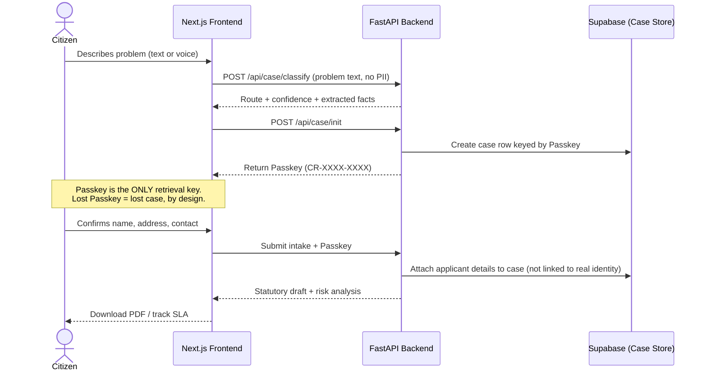
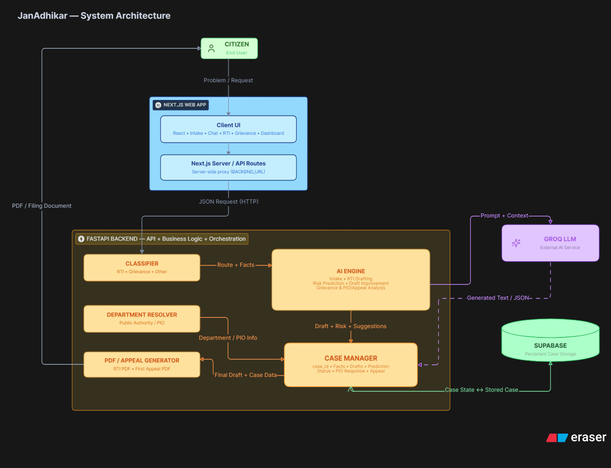

<div align="center">

# ⚖️ Janअधिकार

### *जन अधिकार — The People's Right*

**An AI-native legal engine that turns a citizen's plain-language civic complaint into a filing-ready RTI application, a Section 19(1) First Appeal, or a formal consumer/grievance notice - all with 0 accounts**


<p align="center">
  <a href="#-what-is-janadhikar">Overview</a> •
  <a href="#-why-it-matters">Why It Matters</a> •
  <a href="#-core-features">Features</a> •
  <a href="#%EF%B8%8F-system-architecture">Architecture</a> •
  <a href="#-the-passkey-privacy-model">Privacy Model</a> •
  <a href="#-tech-stack">Tech Stack</a> •
  <a href="#-project-structure">Structure</a> •
  <a href="#-local-setup">Setup</a> •
  <a href="#-legal--engineering-disclaimer">Disclaimer</a>
</p>

</div>

<br/>

## Overview

Filing an RTI or raising a formal grievance in India is still unnecessarily confusing & complicated. You may have to figure out which department handles it, how to frame the request, where to file it, and what to do if nothing happens. Today, people often turn to AI chatbots/ LLMs, scattered government portals, old templates, or paid agents just to piece that process together.

**JanAdhikar** replaces all three with a guided, AI-driven pipeline. A citizen describes their problem in plain language, by typing or by speaking in **English, Hindi, or Hinglish**. And the system:

1. **Classifies** the issue into the correct legal route (Is it an RTI?  A consumer/administrative grievance? Or simply out-of-scope?),
2. **Resolves jurisdiction**, identifying the specific public authority or PIO who actually holds the requested records,
3. **Drafts** a statute-aware document from scratch, implementing the gov-issued, latest RTI form's format,
4. **Stress-tests** RTI drafts against real rejection grounds (Section 8/9 exemptions) ***before*** filing,
5. **Tracks** the statutory 30-day clock and calculates the Section 20(1) penalty accruing against the defaulting officer, and
6. **Escalates** automatically, by generating a court-ready First Appeal the moment a PIO reply is denied, evasive, or simply never comes.

No account, email, or phone number is required for resuming your case. Just a 12-character *Secret Passkey* is the *only* way back into a case.

---

## Why Differentiates Janअधिकार?

| Conventional Way | JanAdhikar Way |
| :--- | :--- |
| ChatGPT drafts RTIs — often vague, legally toothless | **LLM + benchmarked ML classifier draft precise, record-seeking queries** |
| No AI reliably knows the right PIO or authority | **Issue + location → jurisdiction auto-resolved** |
| Filing means hopping across fragmented govt portals | **One guided flow — draft, destination & next steps** |
| Filing is easy; silence after it isn't | **SLA clock runs itself → penalty computed, appeal auto-drafted** |
| Generic AI needs you to already know what to ask | **Starts from your problem, works out what's legally askable** |

---

## Core Features

| Feature | What it actually does |
| :--- | :--- |
| **AI Legal Triage** | An LLM-based classifier routes every complaint into `RTI`, `Rights/Grievance`, or `Other` — with a rule-based fallback engine so the app never hard-fails if the model API is unreachable. Benchmarked against a hand-labeled 30-case test set (`ml/evaluate_classifier.py`) using scikit-learn's classification report & confusion matrix. |
| **Voice Intake with Hinglish Support** | Citizens can dictate their problem. Audio is transcribed via Whisper (`whisper-large-v3`); non-English speech is transcribed and then translated into **Hinglish (Hindi written in the Latin alphabet)** so nothing gets lost to script conversion. |
| **Auto-Jurisdiction Resolution** | A curated jurisdiction knowledge base (roads, pensions, land records, PDS, police, utilities, EPFO, passports…) combined with an LLM resolver identifies the specific Public Information Officer or department — with strict anti-hallucination rules: no invented street addresses, PIN codes, or officer names. |
| **RTI Risk Predictor** | Every drafted RTI is run against the six most common Central Information Commission (CIC) rejection grounds — Section 2(f) opinion-seeking, Section 8(1)(j) privacy, 8(1)(h) ongoing investigation, 8(1)(e) fiduciary relationship, 8(1)(a) sovereignty, and Section 6(3) transfer — and returns a `FULL / PARTIAL / REJECT` probability distribution plus concrete rewrite suggestions. |
| **Auto-Improve Draft** | One click rewrites the RTI to eliminate every detected risk: subjective questions become record requests, overbroad asks get narrowed to a timeline, and a "larger public interest" clause is inserted wherever Section 8(1)(j) is a risk. |
| **Statutory SLA & Penalty Tracker** | Computes the Section 7(1) 30-day response deadline and the Section 19(1) 60-day appeal window from the filing date, flags deemed refusals automatically, and calculates the ₹250/day (capped at ₹25,000) personal penalty owed by a defaulting PIO under Section 20(1). |
| **PIO Reply Analyzer & Auto-Appeal** | Paste in the PIO's actual reply (or flag "no response"); an LLM classifies it as full/partial disclosure, denial, or transfer, extracts the exemption clause cited, and cross-references a CIC precedent knowledge base to draft a fully reasoned **First Appeal under Section 19(1)** — grounds, precedents, and prayer clause included. |
| **Grievance & Consumer Notice Engine** | For non-RTI matters (deposits, refunds, deficiency of service, pension delays), the engine identifies the violated rights, the right forum (CPGRAMS, e-Daakhil, Rent Authority, etc.), and drafts a formal legal demand notice with an 18% p.a. statutory interest clause. |
| **Court-Ready PDF Export** | Server-side PDF generation (ReportLab) renders the official **Form 'A'** RTI layout and the First Appeal document, with graceful plain-text fallback if the PDF library is unavailable. |
| **Zero-Account Privacy** | No sign-up, no OTP, no email capture. A locally-generated Passkey (`CR-XXXX-XXXX`) is the sole key to a case — lose it, and the case is gone by design. |

---

## The Passkey Privacy Model

There are no user accounts anywhere in this system. The Passkey is the entire privacy model, and it's worth looking at on its own:


---

## System Architecture

The platform is a monorepo: a **Next.js 15** frontend (App Router) driving the citizen-facing flow, and a **FastAPI** service handling all AI orchestration, jurisdiction resolution, and document generation — deployed together as a single Vercel project via serverless Python functions.


---

## Tech Stack

| Layer | Technology | Purpose |
| :--- | :--- | :--- |
| Frontend Framework | **Next.js 15** (App Router, TypeScript) | Landing page, dashboard, and SLA tracker as a single deployable app |
| Styling & Motion | **Tailwind CSS**, **Framer Motion** | Court Maroon / Ashoka Navy institutional theme, hand-drawn SVG underline animations, page transitions |
| Client State | **Zustand** (with `persist` middleware) | Multi-step case flow state survives refreshes via `localStorage` |
| Charts | **Recharts** | Radial risk-probability meter on the RTI results screen |
| Backend API | **FastAPI** (Python), deployed as Vercel serverless functions | Classification, jurisdiction resolution, drafting, PDF generation |
| LLM Provider | **Groq** — `llama-3.3-70b-versatile`, `openai/gpt-oss-120b`, `whisper-large-v3` | Classification, drafting, risk prediction, and speech-to-text |
| PDF Generation | **ReportLab** | Statutory Form 'A' RTI applications and First Appeal documents |
| Persistence | **Supabase** | Passkey-keyed case storage, with an in-memory fallback for local dev |
| ML Evaluation | **scikit-learn**, **tabulate** | Classifier accuracy, confusion matrix, and per-class precision/recall against a hand-labeled test set |

---

## Project Structure

```
janadhikar/
├── app/                        # Next.js App Router
│   ├── page.tsx                # Landing page (hero, comparison, legal foundation)
│   ├── Navbar.tsx
│   ├── layout.tsx              # Metadata, JSON-LD, SEO
│   ├── track/                  # SLA & Appellate tracker
│   ├── rti/                    # RTI intake, appeal, result routes
│   ├── dashboard/               # Gateway → intake → result flow
│   └── api/                    # Next.js API routes proxying to FastAPI
│
├── api/                        # FastAPI backend (Vercel serverless entrypoint)
│   ├── index.py                # App entrypoint & all REST routes
│   ├── classifier.py           # Route classifier + PIO reply analyzer
│   ├── department_resolver.py  # Jurisdiction / PIO resolution
│   ├── grievance_resolver.py   # Consumer/grievance rights analysis
│   ├── outcome_predictor.py    # RTI drafting, risk prediction, First Appeal generation
│   ├── case_manager.py         # Passkey-keyed case persistence (Supabase)
│   ├── rti_pdf_generator.py    # Form 'A' PDF rendering
│   ├── appeal_pdf_generator.py # Section 19(1) First Appeal PDF rendering
│   ├── intake_chat.py          # Conversational fact-gathering assistant
│   ├── prompts.py              # All system prompts (classification, drafting, risk rules)
│   └── data/jurisdiction_knowledge.py  # Seed authority/jurisdiction knowledge base
│
├── components/dashboard/       # Chat UI, risk meter, draft viewer, pipeline tracker
├── views/                      # Full-page flows (Gateway, Intake, RTI/Grievance results)
├── store/caseStore.ts          # Zustand case state (persisted)
├── lib/api.ts                  # Typed API client
├── ml/                         # Classifier evaluation harness + labeled test set
└── requirements.txt / package.json
```

---

## Local Setup

### Prerequisites
- Node.js 18+
- Python 3.10+
- A [Groq](https://console.groq.com) API key (LLM + Whisper)
- A [Supabase](https://supabase.com) project (optional — falls back to in-memory storage)
- A [Serper.dev](https://serper.dev) API key (optional, for live address lookups)

### 1. Clone & install
```bash
git clone https://github.com/<your-username>/janadhikar.git
cd janadhikar
npm install
pip install -r requirements.txt --break-system-packages
```

### 2. Configure environment variables
Create a `.env` (or `.env.local`) in the project root:

```env
# LLM Provider (classification, drafting, risk prediction, Whisper transcription)
GROQ_API_KEY=your_groq_key_here

# Optional — live PIO/department address lookups
SERPER_API_KEY=your_serper_key_here

# Optional — persistent case storage (falls back to in-memory if omitted)
SUPABASE_URL=your_supabase_project_url
SUPABASE_KEY=your_supabase_service_key

# Backend URL used by Next.js API routes when running FastAPI separately
BACKEND_URL=http://127.0.0.1:8000
```

> ⚠️ Never commit `.env` files. They're already covered by `.gitignore`.

### 3. Run the backend
```bash
uvicorn api.index:app --reload --port 8000
```

### 4. Run the frontend
```bash
npm run dev
```

The app will be available at `http://localhost:3000`, with `/api/*` requests rewritten to the FastAPI service via `next.config.ts`.

### 5. (Optional) Evaluate the classifier
```bash
python ml/evaluate_classifier.py
```
Prints per-case predictions, overall accuracy, a full `sklearn` classification report, and a confusion matrix against the 30-example labeled test set.

---

## Planned Future Implementations

- [ ] Multi-language drafting beyond Hinglish (native Devanagari + regional languages)
- [ ] Direct e-filing integration with `rtionline.gov.in` and state RTI portals
- [ ] Offline-first PWA mode
- [ ] Community-verified PIO/department address database
- [ ] Expanded jurisdiction knowledge base coverage

---

## Important Disclaimer

> **This is a legal drafting tool, not a law firm.** JanAdhikar generates documents using AI models against official statutory standards, but every citizen must:
> - Verify all names, dates, amounts, and facts before submission
> - Confirm the application is addressed to the correct PIO / office
> - Consult a legal professional for complex or high-stakes disputes

---

## Contributing

Contributions are especially welcome around:
- Expanding the department/jurisdiction knowledge base
- Improving RTI Section 8/9 risk-assessment accuracy
- Growing the labeled classifier test set
- Accessibility and regional language support

Please open an issue before submitting large PRs so the approach can be discussed first.

---

## License

Code wants to be free too! MIT — see `LICENSE` for details.

<div align="center">

**The people's right, finally usable. 🇮🇳**

</div>
