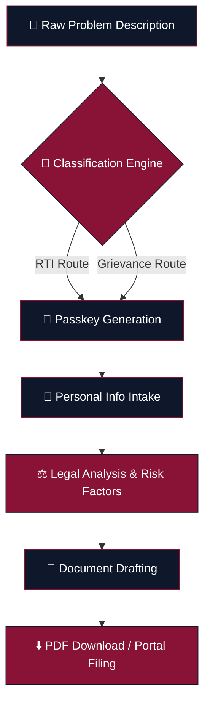
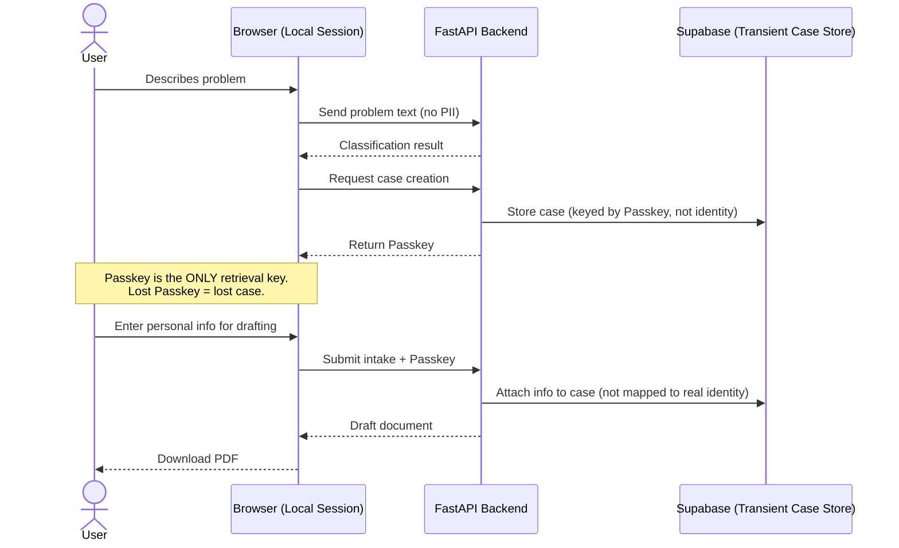
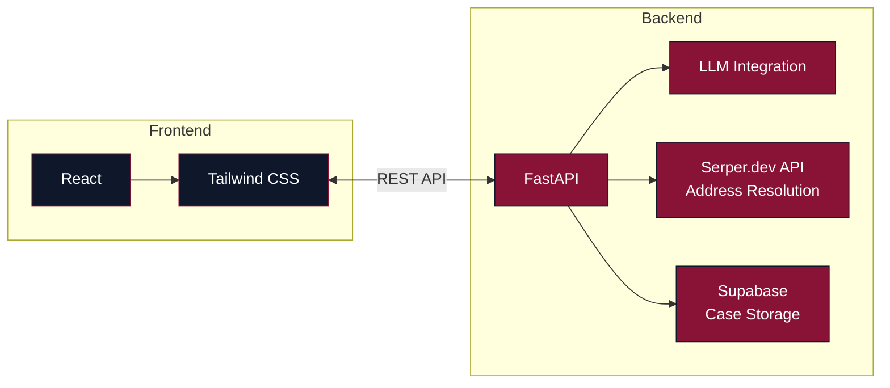

<div align="center">

# ⚖️ JanAdhikar

### *जन अधिकार — People's Right*

**A local-first legal engine that helps Indian citizens draft RTI applications and administrative grievance notices — privately, without accounts, without tracking.**


</div>

---

## Table of Contents

- [What is JanAdhikar?](#what-is-janadhikar)
- [Why It Exists](#why-it-exists)
- [How It Works — Architecture Flow](#how-it-works--architecture-flow)
- [Privacy Model — Passkey Flow](#privacy-model--passkey-flow)
- [Core Features](#core-features)
- [Tech Stack](#tech-stack)
- [Project Structure](#project-structure)
- [Local Setup](#local-setup)
- [Environment Variables](#environment-variables)
- [Roadmap](#roadmap)
- [Disclaimer](#important-disclaimer)
- [Contributing](#contributing)
- [License](#license)

---

## What is JanAdhikar?

JanAdhikar turns a plain-language description of a citizen's problem — *"My ration card application has been pending for 3 months and no one is responding"* — into a **legally structured, statute-aware document**: either a **Right to Information (RTI) application** or an **administrative grievance notice**, addressed to the correct authority, in the correct format.

It is built on one core principle: **the user should never have to create an account or hand over personal data to a server to exercise a legal right.**

---

## Why It Exists

Filing an RTI or a grievance in India today usually means one of:

- Paying a "typist" or agent near a government office to draft it for you
- Copy-pasting a generic template off a random blog and hoping it's addressed correctly
- Giving up because you don't know which department or PIO (Public Information Officer) to write to

JanAdhikar collapses this into a guided, AI-assisted flow that stays **local-first and disposable** — your case exists only as long as you hold its Passkey.

---

## How It Works — Architecture Flow

The system takes a user from a raw problem description to a filed-ready document through a strict, linear pipeline. This ensures every document that comes out the other end has passed through classification, legal risk analysis, and structured drafting.



| Stage | What Happens |
|---|---|
| **Classification Engine** | Determines whether the user's issue is best served by an RTI request (information-seeking) or a grievance notice (action-seeking / complaint), and identifies jurisdiction. |
| **Passkey Generation** | A unique, locally-held key is generated. This — not an account — is the user's only way back into the case. |
| **Personal Info Intake** | Minimal fields required to legally file the document (name, address, department context). Never linked to the Passkey on the server. |
| **Legal Analysis & Risk Factors** | For RTI: checked against Section 8/9 exemptions. For grievances: mapped to the relevant consumer/administrative rights framework. |
| **Document Drafting** | Statutory language is synthesized contextually — not pulled from a static template. |
| **PDF Download / Portal Filing** | User exports a ready-to-file PDF, or is guided to the correct online portal. |

---

## Privacy Model — Passkey Flow

Because there are no user accounts, the Passkey is the single load-bearing piece of the entire privacy model. It's worth visualizing separately from the main pipeline:



**Key guarantee:** the server never links a Passkey or case record to a phone number, email address, or any other persistent identifier. If a user closes the tab without saving their Passkey, the case is effectively unrecoverable — that's the trade-off privacy-by-design makes on purpose.

---

## Core Features

### 🔒 1. Privacy-By-Design
- **No server-side user profiles** — nothing to breach, nothing to subpoena.
- **Passkey System** — every case is secured locally; the case ID/Passkey is the only key to retrieve a session.
- **Encryption** — data is handled client-side or held only transiently server-side; it is never mapped to PII (phone numbers, email addresses).

### 🧠 2. Legal Intelligence
- **Auto-Resolution** — automatically identifies the correct government department or authority based on the issue and jurisdiction, using live address resolution.
- **Risk Predictor** — for RTI applications, runs an assessment against **Section 8/9 exemptions** of the RTI Act to flag likely rejection grounds before filing.
- **Contextual Drafting** — synthesizes official statutory language and relevant consumer/administrative rights specific to the grievance, rather than filling in a static template.

---

## Tech Stack



| Layer | Technology | Purpose |
|---|---|---|
| Frontend | React + Tailwind CSS | UI, local session/Passkey handling |
| Backend | FastAPI (Python) | API, LLM orchestration, drafting logic |
| Address Resolution | Serper.dev API | Resolves the correct department/PIO address |
| Persistence | Supabase | Transient, Passkey-keyed case storage |
| Theming | `#881337` Court Maroon · `#0F172A` Ashoka Navy | Brand palette |

---

## Project Structure

```
janadhikar/
├── frontend/                 # React application (Tailwind CSS)
│   ├── src/
│   │   ├── components/
│   │   ├── pages/
│   │   └── theme/            # Court Maroon (#881337) / Ashoka Navy (#0F172A)
│   └── package.json
│
├── backend/                  # FastAPI service
│   ├── main.py                # App entrypoint
│   ├── routes/                # Classification, intake, drafting endpoints
│   ├── services/
│   │   ├── llm.py             # LLM integration for drafting
│   │   ├── address_resolver.py # Serper.dev-based department lookup
│   │   └── risk_predictor.py  # Section 8/9 exemption analysis
│   ├── db/                    # Supabase client & case models
│   ├── requirements.txt
│   └── .env                   # API keys (not committed)
│
└── README.md
```

---

## Local Setup

### Prerequisites
- Python 3.10+
- Node.js 18+
- A Supabase account (for persistence)
- A Serper.dev API key (for address resolution)

### 1. Clone the repo
```bash
git clone https://github.com/yourusername/janadhikar.git
cd janadhikar
```

### 2. Set up the backend
```bash
cd backend
pip install -r requirements.txt

# Create a .env file with your API keys (see below)

uvicorn main:app --reload
```

### 3. Set up the frontend
```bash
cd frontend
npm install
npm run dev
```

The frontend will typically run on `http://localhost:5173` and the backend on `http://localhost:8000` (adjust as configured).

---

## Environment Variables

Create a `.env` file inside `/backend` with the following:

```env
# LLM Provider
ANTHROPIC_API_KEY=your_key_here

# Address resolution
SERPER_API_KEY=your_key_here

# Persistence
SUPABASE_URL=your_supabase_project_url
SUPABASE_KEY=your_supabase_service_key
```

> ⚠️ Never commit `.env` to version control. Add it to `.gitignore`.

---

## Roadmap

- [ ] Multi-language drafting support (Hindi + regional languages)
- [ ] Direct e-filing integration with RTI Online portals where available
- [ ] Offline-first PWA mode
- [ ] Community-verified department address database

---

## Important Disclaimer

> **This is a legal drafting tool, not a law firm.**
>
> JanAdhikar generates documents using AI models. While official standards for RTI and Grievance notices are used, users must:
> - ✅ Verify all facts, dates, and names before submission
> - ✅ Ensure the generated application is addressed to the correct PIO/Office
> - ✅ Consult a legal professional for complex disputes
>
> **This is an AI-generated document — verify thoroughly before submission.**

---

## Contributing

Contributions are welcome, especially around:
- Expanding the department/jurisdiction address database
- Improving RTI Section 8/9 risk-assessment accuracy
- Accessibility and regional language support

Please open an issue before submitting large PRs so the approach can be discussed first.

---

## License

MIT — see `LICENSE` for details.

<div align="center">

**Built for the Indian Citizen. 🇮🇳**

</div>
